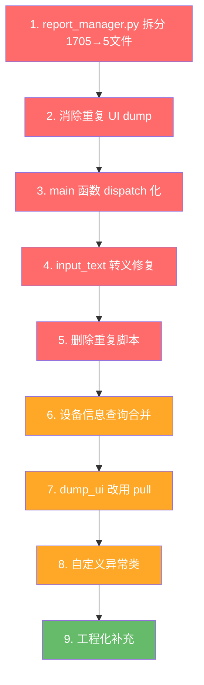

# src/ 代码审查与优化建议

审查时间：2026-05-18
范围：`src/` 下全部 8 个 Python 文件

---

## 总览

| 文件 | 行数 | 职责 | 健康度 |
|------|------|------|--------|
| [`main.py`](src/main.py:1) | 851 | CLI 入口、命令路由、参数解析 | ⚠️ 需重构 |
| [`adb_client.py`](src/adb_client.py:1) | 247 | ADB 底层封装 | ✅ 较稳定 |
| [`ui_parser.py`](src/ui_parser.py:1) | 138 | XML 解析、compact/full、查找 | ✅ 较稳定 |
| [`output.py`](src/output.py:1) | 70 | JSON 输出格式化 | ✅ 稳定 |
| [`app_manager.py`](src/app_manager.py:1) | 72 | App 管理命令 | ✅ 稳定 |
| [`report_manager.py`](src/report_manager.py:1) | 1705 | 报告生命周期 + HTML 渲染 | 🔴 急需拆分 |
| [`rebuild_report_assets.py`](src/rebuild_report_assets.py:1) | 58 | 报告资源重建工具 | ⚠️ 小问题 |
| [`visualize_hierarchy.py`](src/visualize_hierarchy.py:1) | 217 | UI 树可视化（实验性） | ⚠️ 可归档 |

---

## 一、高优先级（影响正确性/可维护性）

### 1.1 `report_manager.py` 过于庞大（1705 行）

**问题**：单个文件集成了报告生命周期、execution 记录、business step 推导、HTML 渲染、截图聚焦预览（PIL 绘图）等完全不同的关注点。`_build_html()` 一个方法就占约 900 行。

**建议拆分**：

```
src/report/
├── __init__.py
├── manager.py          # ReportManager 主类, 生命周期 (start/finalize/case)
├── execution.py        # record_execution, add_note, _save_execution_file
├── analysis.py         # _build_execution_analysis, _derive_business_steps, _build_report_summary
├── assets.py           # _persist_visual_assets, _build_focus_preview, _parse_bounds, _can_use_direct_mapping
├── html_renderer.py    # _build_html, _render_html (模板引擎或至少独立文件)
└── utils.py            # slugify, ensure_dir, now_iso, now_ts_ms, ActiveReportState
```

**收益**：每个模块 < 400 行，单一职责，易于测试和修改。

---

### 1.2 `main.py` 中存在重复的 UI dump

**问题**：多个命令在同一生命周期内重复抓取 UI，导致不必要的 ADB 往返。

具体表现：
- [`cmd_tap()`](src/main.py:219) 中 [`_resolve_element()`](src/main.py:208) 调用一次 `adb.dump_ui()` + `parse_xml()`
- [`cmd_exists()`](src/main.py:390) 又独立调用一次
- [`cmd_wait()`](src/main.py:406) 在循环中每次迭代都 `dump_ui()` + `parse_xml()`

**建议**：

```python
# 在 ADBClient 或模块级别增加 LRU 缓存
from functools import lru_cache

class ADBClient:
    @lru_cache(maxsize=1)
    def _dump_ui_cached(self, cache_key: int) -> str:
        return self.dump_ui()

# 使用时间戳作为缓存键，确保不会返回过期数据
def get_cached_ui(adb: ADBClient) -> tuple[list[dict], str]:
    """返回 (elements, xml_raw)，同一秒内复用"""
    ...
```

或者更简单：在 `main()` 函数层面加一个 `_last_dump` 字典，避免同一命令处理流程中重复 dump。

**收益**：减少 30-50% 的 ADB 往返次数，操作响应更快。

---

### 1.3 `main()` 中 100 行的 if/elif 链

**问题**：[`main()`](src/main.py:722) 中 722-824 行是巨大的 if/elif/elif 链，每增加一个命令就要修改核心调度逻辑。

**建议**：使用命令注册表（dispatch dict）：

```python
COMMANDS = {
    "device":     lambda adb, args: cmd_device_info(adb),
    "page":       lambda adb, args: cmd_page_info(adb),
    "dump":       lambda adb, args: cmd_dump(adb, getattr(args, "screenshot", False)),
    "find":       lambda adb, args: cmd_find(adb, args.query),
    "screenshot": lambda adb, args: cmd_screenshot(adb, getattr(args, "path", None)),
    "tap":        lambda adb, args: cmd_tap(adb, args),
    "input":      lambda adb, args: cmd_input(adb, args),
    "scroll":     lambda adb, args: cmd_scroll(adb, args.direction),
    "back":       lambda adb, args: cmd_back(adb),
    "keyevent":   lambda adb, args: cmd_keyevent(adb, args.key),
    "exists":     lambda adb, args: cmd_exists(adb, args.query),
    "get-text":   lambda adb, args: cmd_get_text(adb, args.query),
    "wait":       lambda adb, args: cmd_wait(adb, args.query, args.timeout),
}

def main():
    ...
    handler = COMMANDS.get(args.group)
    if handler:
        result = handler(adb, args)
    else:
        result = error("cli", "UNKNOWN_COMMAND", f"未知命令：{args.group}")
```

> **注意**：`app` 和 `report` 命令有二级路由（`args.action`），可以单独处理或嵌套 dispatch。

**收益**：`main()` 从 100+ 行缩减到 ~20 行，新增命令只需注册，无需改动调度逻辑。

---

### 1.4 `input_text()` 转义不完整

**问题**：[`adb_client.input_text()`](src/adb_client.py:121) 只处理了空格和单引号：

```python
escaped = text.replace(" ", "%s").replace("'", "\\'")
```

Android `input text` 对以下字符也敏感：`&`, `<`, `>`, `|`, `;`, `$`, `\n`, `"`, `(`, `)`, `` ` ``。

**建议**：

```python
def input_text(self, text: str):
    """输入文字，使用 input keyevent 逐字符输入更稳定"""
    # 方案 A：逐字符转义
    escaped = text.replace(" ", "%s")
    for ch in "&<>|;$`\"()":
        escaped = escaped.replace(ch, f"\\{ch}")
    self.shell("input", "text", escaped)
    
    # 方案 B（更可靠）：使用 adb shell am broadcast -a ADB_INPUT_TEXT --es msg "..."
    # 但这需要设备端支持
```

**收益**：避免特殊字符导致的输入错误或 shell 注入。

---

### 1.5 重复脚本问题

**问题**：以下脚本在项目根目录和 `src/` 各有一份：

| 根目录 | src/ |
|--------|------|
| `realtime_cleaner.py` | `src/realtime_cleaner.py` |
| `analyze_ui_depth.py` | `src/analyze_ui_depth.py` |
| `generate_structure.py` | `src/generate_structure.py` |
| `visualize_hierarchy.py` | `src/visualize_hierarchy.py` |

根据 [`CLAUDE.md`](CLAUDE.md:61) 注释，根目录版本为"早期实验脚本（可删除）"。

**建议**：删除根目录的重复脚本，`data/` 目录保留实验数据即可。

---

## 二、中优先级（性能/健壮性）

### 2.1 `adb_client.py` 中多次独立查询设备信息

**问题**：`get_device_info()` 每次调用发起 6 次独立的 `adb shell` 调用（5 次 `getprop` + 1 次 `wm size`）。`is_connected()` 和 `get_serial()` 各自运行 `adb devices`。

**建议**：

```python
def get_device_info(self) -> dict:
    """一次性获取设备信息，减少 ADB 往返"""
    # 用一次 shell 调用获取多个属性
    output = self.shell("getprop")
    props = {}
    for line in output.splitlines():
        if "ro.product.model" in line:
            ...
    # wm size 单独获取（无法合并）
```

或者至少缓存 `get_device_info()` 结果（设备信息不变）。

**收益**：`device info` 命令从 6 次 shell 调用减少到 2 次。

---

### 2.2 `dump_ui()` 使用 `cat` 而非 `pull`

**问题**：[`dump_ui()`](src/adb_client.py:109) 通过 `adb shell cat <remote_path>` 读取 XML，可能因特殊字符或编码问题导致内容截断/损坏。

**建议**：

```python
def dump_ui(self, remote_path="/sdcard/_ad_cli_ui.xml") -> str:
    """dump 当前 UI 树，返回 XML 字符串"""
    self.shell("uiautomator", "dump", remote_path, timeout=15)
    # 使用 pull 到临时文件，再用 Python 读取
    import tempfile, os
    with tempfile.NamedTemporaryFile(suffix=".xml", delete=False) as tmp:
        tmp_path = tmp.name
    try:
        self.run("pull", remote_path, tmp_path, timeout=10)
        with open(tmp_path, "r", encoding="utf-8") as f:
            return f.read()
    finally:
        os.unlink(tmp_path)
```

**收益**：避免 `cat` 的编码和截断问题，特别是包含 emoji 或特殊字符的 UI 文本。

---

### 2.3 `wait_stable()` 返回值语义错误

**问题**：[`wait_stable()`](src/adb_client.py:235) 始终返回 `True`（即使超时），调用方无法区分"页面稳定"和"超时放弃"。

**建议**：

```python
def wait_stable(self, timeout_ms: int = 2000, interval_ms: int = 200) -> bool:
    deadline = time.time() + timeout_ms / 1000
    last_page = self.get_current_page()
    time.sleep(interval_ms / 1000)
    while time.time() < deadline:
        current_page = self.get_current_page()
        if current_page == last_page:
            return True   # 真正稳定
        last_page = current_page
        time.sleep(interval_ms / 1000)
    return False  # 超时
```

---

### 2.4 `output.py` 缺少错误码枚举

**问题**：错误码（`DEVICE_DISCONNECTED`, `ELEMENT_NOT_FOUND`, `AMBIGUOUS_MATCH` 等）是散落的字符串，容易出现拼写错误。

**建议**：

```python
from enum import StrEnum

class ErrorCode(StrEnum):
    DEVICE_DISCONNECTED = "DEVICE_DISCONNECTED"
    ELEMENT_NOT_FOUND = "ELEMENT_NOT_FOUND"
    AMBIGUOUS_MATCH = "AMBIGUOUS_MATCH"
    APP_NOT_INSTALLED = "APP_NOT_INSTALLED"
    TIMEOUT = "TIMEOUT"
    PERMISSION_DENIED = "PERMISSION_DENIED"
    REPORT_NOT_ACTIVE = "REPORT_NOT_ACTIVE"
    # ...
```

---

### 2.5 `main()` 错误处理依赖字符串匹配

**问题**：[`main()`](src/main.py:828) 通过检查 `RuntimeError` 消息中是否包含特定中文字符串来分类错误：

```python
if "当前没有激活中的报告" in msg:
    result = error("report", "REPORT_NOT_ACTIVE", msg)
elif "当前没有运行中的 case" in msg:
    result = error("report", "REPORT_CASE_NOT_ACTIVE", msg)
```

**建议**：定义专用异常类：

```python
class ReportError(RuntimeError):
    def __init__(self, code: ErrorCode, message: str):
        super().__init__(message)
        self.code = code

# 使用:
raise ReportError(ErrorCode.REPORT_NOT_ACTIVE, "当前没有激活中的报告")

# main() 中:
except ReportError as e:
    result = error("report", e.code.value, str(e))
```

---

## 三、低优先级（代码质量/工程化）

### 3.1 缺少 `requirements.txt` / `pyproject.toml`

[`CLAUDE.md`](CLAUDE.md:38) 提到了 `requirements.txt` 但实际不存在。项目依赖 `Pillow`（PIL），但无人知晓版本要求。

```txt
# requirements.txt
Pillow>=9.0.0
```

---

### 3.2 缺少类型标注

`main.py` 中绝大多数函数缺少类型标注，只有少数（如 [`_parse_resolution()`](src/main.py:123)）有。建议渐进式添加 `def cmd_dump(adb: ADBClient, with_screenshot: bool = False) -> dict:`。

---

### 3.3 `cmd_app_install()` 中 `import os` 在函数内部

[`app_manager.py`](src/app_manager.py:53) 在函数体内部 `import os`，应移到文件顶部。

---

### 3.4 `report start` 存在竞态条件

[`start_report()`](src/report_manager.py:371) 中先检查 `os.path.exists()` 再创建目录，存在 TOCTOU 问题：

```python
# 当前:
if os.path.exists(report_dir) and os.listdir(report_dir):
    raise RuntimeError(...)
ensure_dir(report_dir)

# 建议: 直接尝试创建，捕获异常
try:
    os.makedirs(report_dir, exist_ok=False)
except FileExistsError:
    if os.listdir(report_dir):
        raise RuntimeError(...)
```

---

### 3.5 `_derive_business_steps()` 存在代码重复

[`report_manager.py`](src/report_manager.py:217) 中 if/else 两个分支创建了几乎相同的初始 `current_step` 字典，只是触发条件不同：

```python
# 当前: 217-243 行，两个几乎相同的字典构造
# 建议: 提取公共方法
def _make_business_step(self, execution: dict, index: int) -> dict:
    return {
        "id": f"bstep-{index:03d}",
        "title": self._business_step_title(execution),
        ...
    }
```

---

### 3.6 `rebuild_report_assets.py` 不应调用私有方法

[`rebuild_report_assets.py`](src/rebuild_report_assets.py:41) 直接调用 `manager._build_focus_preview()` 和 `manager._render_html()`，应将这些方法提升为公开 API 或提供公共包装。

---

### 3.7 `.ad_cli_active_report.json` 散落在工作目录

[`report_manager.py`](src/report_manager.py:28) 使用 `.ad_cli_active_report.json` 作为激活状态文件，该文件可能意外提交到 Git 或遗留。建议放在 `~/.ad-cli/` 或项目级 `.ad-cli/` 目录下。

---

## 四、优化优先级排序



| 优先级 | 编号 | 变更 | 影响范围 |
|--------|------|------|----------|
| 🔴 高 | 1.1 | `report_manager.py` 拆分 | `report_manager.py`, 新建 5 文件 |
| 🔴 高 | 1.2 | UI dump 缓存 | `main.py`, `adb_client.py` |
| 🔴 高 | 1.3 | main 函数 dispatch 化 | `main.py` |
| 🔴 高 | 1.4 | input_text 转义修复 | `adb_client.py` |
| 🔴 高 | 1.5 | 删除重复脚本 | 根目录 4 文件 |
| 🟠 中 | 2.1 | 设备信息查询合并 | `adb_client.py` |
| 🟠 中 | 2.2 | dump_ui 改用 pull | `adb_client.py` |
| 🟠 中 | 2.3 | wait_stable 返回值修正 | `adb_client.py` |
| 🟠 中 | 2.4 | 错误码枚举 | `output.py` 新建 |
| 🟠 中 | 2.5 | 自定义异常类 | `main.py`, `report_manager.py` |
| 🟢 低 | 3.1 | requirements.txt | 新建文件 |
| 🟢 低 | 3.2 | 类型标注补充 | 全局 |
| 🟢 低 | 3.3 | import os 移到顶部 | `app_manager.py` |
| 🟢 低 | 3.4 | TOCTOU 修复 | `report_manager.py` |
| 🟢 低 | 3.5 | _derive_business_steps 去重 | `report_manager.py` |
| 🟢 低 | 3.6 | 私有方法提升 | `report_manager.py`, `rebuild_report_assets.py` |
| 🟢 低 | 3.7 | 状态文件位置 | `report_manager.py` |

---

## 五、与 docs/REPORT_OPTIMIZATION_SUGGESTIONS.md 的关系

[`docs/REPORT_OPTIMIZATION_SUGGESTIONS.md`](docs/REPORT_OPTIMIZATION_SUGGESTIONS.md:1) 侧重于**报告的业务视角优化**（业务步骤层 vs 原子执行层、失败归因、case 状态稳定性），本文侧重于**代码结构和工程质量**。两者互补，建议同步推进。