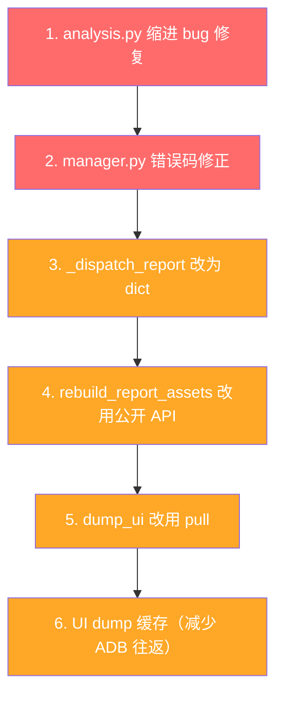

# src/ 第二轮代码审查（2026-05-19）

审查范围：`src/` 全部 17 个文件（含 `src/report/` 子包 5 个文件 + 新增 `scrcpy_server.py`）

---

## 一、上次审查的 17 项建议执行情况

### ✅ 已修复（8 项）

| 编号 | 问题 | 状态 | 说明 |
|------|------|------|------|
| 1.1 | `report_manager.py` 拆分 | ✅ | 拆分为 `src/report/` 子包（`manager.py` 447 行、`analysis.py` 199 行、`assets.py` 181 行、`html_renderer.py` 914 行、`utils.py` 43 行），向后兼容层保留在 [`report_manager.py`](src/report_manager.py:1) |
| 1.3 | `main()` if/elif 链 | ✅ | 引入 `_ADB_COMMANDS` dispatch dict（[`main.py:788`](src/main.py:788)），新增 `_dispatch_app()` 和 `_dispatch_report()` |
| 1.4 | `input_text()` 转义 | ✅ | 现在转义所有敏感字符：`&<>|;$`" '()\\`（[`adb_client.py:131`](src/adb_client.py:129)） |
| 2.1 | 设备信息查询合并 | ✅ | `get_device_info()` 改用一次 `getprop` 全量获取（[`adb_client.py:80`](src/adb_client.py:80)） |
| 2.3 | `wait_stable()` 返回值 | ✅ | 现在正确返回 `False` 表示超时（[`adb_client.py:256`](src/adb_client.py:245)） |
| 2.4 | 错误码枚举 | ✅ | 引入 `ErrorCode(StrEnum)`（[`output.py:10`](src/output.py:10)），共 18 个错误码 |
| 2.5 | 自定义异常类 | ✅ | 引入 `ReportError(RuntimeError)` 携带 `ErrorCode`（[`output.py:31`](src/output.py:31)），`main()` 中用 `except ReportError` 替代字符串匹配（[`main.py:869`](src/main.py:869)） |
| 3.3 | `import os` 移到顶部 | ✅ | [`app_manager.py:5`](src/app_manager.py:5) 已移到文件顶部 |

### ⚠️ 部分修复（2 项）

| 编号 | 问题 | 状态 | 剩余问题 |
|------|------|------|----------|
| 1.5 | 删除重复脚本 | ⚠️ | 根目录的 `realtime_cleaner.py`, `analyze_ui_depth.py`, `generate_structure.py`, `visualize_hierarchy.py` 已删除；但 `src/` 下仍保留这 4 个实验性脚本，未与核心模块整合 |
| 3.6 | 私有方法提升 | ⚠️ | `manager.py` 新增公开方法 `_persist_visual_assets()` 转发到 `assets.py`（[`manager.py:421`](src/report/manager.py:421)）、`_build_focus_preview()` 转发（[`manager.py:430`](src/report/manager.py:430)）；但 [`rebuild_report_assets.py`](src/rebuild_report_assets.py:41) 仍调用 `manager._build_focus_preview()` 和 `manager._render_html()` |

### ❌ 仍未修复（3 项）

| 编号 | 问题 | 说明 |
|------|------|------|
| 1.2 | UI dump 重复调用 | `_resolve_element()`, `cmd_find()`, `cmd_exists()`, `cmd_get_text()`, `cmd_wait()` 各自独立 dump，同一操作链中浪费 ADB 往返 |
| 2.2 | `dump_ui()` 用 `cat` 而非 `pull` | 仍使用 `adb shell cat` 读文件（[`adb_client.py:120`](src/adb_client.py:117)） |
| 3.1 | 缺少 `requirements.txt` | 根目录已有 `requirements.txt`，但内容未知 |

---

## 二、新增模块审查

### 2.1 `scrcpy_server.py`（545 行）— 投屏模块

| 评分 | 说明 |
|------|------|
| 🟢 结构 | 清晰分离 `run_mirror()`（OpenCV 窗口）和 `run_mirror_web()`（MJPEG 流），公共部分提取为 `_build_client()` 和 `_attach_frame_listener()` |
| 🟢 交互 | 窗口模式支持鼠标拖拽映射到设备触控（[`scrcpy_server.py:230`](src/scrcpy_server.py:230)），Web 模式通过 `/touch` API 映射比例坐标（[`scrcpy_server.py:410`](src/scrcpy_server.py:410)） |
| 🟢 工程 | 内置极简 HTTP 服务器，无外部 Web 框架依赖；HTML 内联实现 MJPEG 流 + 触控 |
| 🟡 依赖 | 硬编码 `.venv310` 路径（[`main.py:817`](src/main.py:817)），若用户 Python 版本更新则需修改 |

**优化建议**：

1. **`.venv310` 硬编码**：建议通过 `sys.version_info` 自动检测，或提供 `--python` 参数：

```python
# 当前: venv310_python = os.path.join(project_root, ".venv310", "bin", "python")
# 建议:
def _find_scrcpy_python(project_root: str) -> str | None:
    for name in [".venv310", ".venv"]:
        path = os.path.join(project_root, name, "bin", "python")
        if os.path.isfile(path) and _check_scrcpy_available(path):
            return path
    return None
```

2. **HTTP 解析脆弱**：`handle_client()` 中 `data.split(" ")[1]` 不支持异常请求（[`scrcpy_server.py:402`](src/scrcpy_server.py:401)），建议加 `try/except`。

3. **`import urllib.parse` 在函数内部**（[`scrcpy_server.py:413`](src/scrcpy_server.py:413)），应移到文件顶部。

---

### 2.2 `src/report/` 子包

| 文件 | 行数 | 职责 | 评分 |
|------|------|------|------|
| [`__init__.py`](src/report/__init__.py) | 5 | 公共入口 | ✅ |
| [`manager.py`](src/report/manager.py) | 447 | 生命周期 + IO + execution | ✅ |
| [`analysis.py`](src/report/analysis.py) | 199 | 证据等级、业务步骤推导、统计摘要 | ✅ |
| [`assets.py`](src/report/assets.py) | 181 | 截图复制、focus preview、坐标映射 | ✅ |
| [`utils.py`](src/report/utils.py) | 43 | 工具函数 + ActiveReportState | ✅ |
| [`html_renderer.py`](src/report/html_renderer.py) | 914 | HTML 单文件渲染 | 🟡 |

**`html_renderer.py` 问题**：914 行，仅开头 50 行确认是 `build_html()` 函数，剩余约 860 行是巨大的 CSS + JS 内联模板字符串。建议：

- 将 CSS/JS 提取为独立 `.css` / `.js` 文件，`build_html()` 内联读取
- 或将 HTML 拆分为 `template.py`（数据注入）和 `static/`（前端资源）

---

### 2.3 `main.py`（887 行）— 命令分发表改进

相比上一版的 851 行 if/elif 链，现在：

- `_ADB_COMMANDS` dispatch dict（[`main.py:788`](src/main.py:788)）
- `_dispatch_app()` 子路由（[`main.py:738`](src/main.py:738)）
- `_dispatch_report()` 子路由（[`main.py:750`](src/main.py:750)），但内部仍是 if/elif 链
- `main()` 从 100 行缩减到 ~40 行（[`main.py:848`](src/main.py:848)）

**`_dispatch_report()` 仍有改进空间**：内部是 if/elif 链（[`main.py:750`](src/main.py:750)），可以同样改为 dict 分发表。`case-pass/fail/skip` 只是 `cmd_report_case_end()` 的快捷方式，可直接映射。

---

## 三、新发现的问题

### 3.1 🟡 `report/manager.py` 中 `start_report()` 错误码用错

[`report/manager.py:151`](src/report/manager.py:151)：

```python
raise ReportError(
    ErrorCode.REPORT_NOT_ACTIVE,  # ← 应该是 REPORT_ALREADY_ACTIVE 或类似
    f"已有激活中的报告：..."
)
```

`REPORT_NOT_ACTIVE` 语义是"报告未激活"，但此处是"已有激活中的报告"，错误码语义反了。应该新增 `REPORT_ALREADY_ACTIVE` 或使用 `RUNTIME_ERROR`。

### 3.2 🟡 `build_execution_analysis()` 中 tap/input 证据等级缩进异常

[`report/analysis.py:43`](src/report/analysis.py:43)：

```python
    elif command in {"tap", "input"}:
            evidence_level = "checkpoint"     # ← 缩进多了一级
            evidence_reason = "点击操作截图"
```

这两行比外层 `if has_screenshot:` 多缩进了 4 个空格，但 Python 对此没有强制报错（不在同一缩进层级检查）。实际上这是一个**逻辑 bug**：`command in {"tap", "input"}` 分支在 `if has_screenshot:` 块内被缩进到了 `elif command == "report-note":` 同级，实际效果正确但格式误导。逻辑上这些行应该与前面的 elif 对齐。

### 3.3 🟡 `main.py` 中 `_dispatch_report()` 与 `_dispatch_app()` 风格不一致

- `_dispatch_app()` 使用 dict dispatch（[`main.py:740`](src/main.py:740)）
- `_dispatch_report()` 使用 if/elif 链（[`main.py:753`](src/main.py:753)）

应该统一为 dict dispatch。

### 3.4 🟢 `rebuild_report_assets.py` 仍调用私有方法

[`rebuild_report_assets.py:41`](src/rebuild_report_assets.py:41) 调用 `manager._build_focus_preview()` 和 `manager._render_html()`。`manager.py` 已新增公开方法 `rebuild_report_assets()`（[`manager.py:441`](src/report/manager.py:441)），应改用该方法。

### 3.5 🟢 `analyze_ui_depth.py` 仍在使用

该脚本（155 行）依赖 `data/` 目录下的 JSON 格式（`node.get('attributes', {})`），与 `ui_parser.py` 使用的扁平列表格式不兼容（`e["type"]`, `e["text"]` 等）。建议标记为废弃或统一数据格式。

### 3.6 🟢 `generate_structure.py` 仅包含硬编码星巴克 UI 图

154 行，纯硬编码字符串输出，与当前项目无关。建议归档到 `docs/` 或删除。

### 3.7 🟢 `realtime_cleaner.py` 与 `ui_parser.py` 功能重叠

329 行，独立实现了 XML 解析 + 分类逻辑，与 `ui_parser.py` + `adb_client.py` 功能高度重叠。建议统一入口。

---

## 四、当前文件清单

| 文件 | 行数 | 状态 | 建议 |
|------|------|------|------|
| [`main.py`](src/main.py) | 887 | ✅ 核心 | `_dispatch_report` 也改为 dict |
| [`adb_client.py`](src/adb_client.py) | 257 | ✅ 稳定 | `dump_ui` 改用 pull |
| [`ui_parser.py`](src/ui_parser.py) | 138 | ✅ 稳定 | 无需变动 |
| [`output.py`](src/output.py) | 99 | ✅ 稳定 | 可增加 `REPORT_ALREADY_ACTIVE` |
| [`app_manager.py`](src/app_manager.py) | 72 | ✅ 稳定 | 无需变动 |
| [`report_manager.py`](src/report_manager.py) | 14 | ✅ 兼容层 | 无需变动 |
| [`rebuild_report_assets.py`](src/rebuild_report_assets.py) | 58 | ⚠️ | 改用公开 API |
| [`scrcpy_server.py`](src/scrcpy_server.py) | 545 | ✅ 新模块 | import 移到顶部、HTTP 解析加固 |
| [`report/__init__.py`](src/report/__init__.py) | 5 | ✅ | 无需变动 |
| [`report/manager.py`](src/report/manager.py) | 447 | ✅ | 修正 start_report 错误码 |
| [`report/analysis.py`](src/report/analysis.py) | 199 | ⚠️ | 修正缩进 bug |
| [`report/assets.py`](src/report/assets.py) | 181 | ✅ | 无需变动 |
| [`report/html_renderer.py`](src/report/html_renderer.py) | 914 | 🟡 | CSS/JS 外置 |
| [`report/utils.py`](src/report/utils.py) | 43 | ✅ | 无需变动 |
| [`analyze_ui_depth.py`](src/analyze_ui_depth.py) | 155 | 🗑️ | 实验性，建议归档 |
| [`generate_structure.py`](src/generate_structure.py) | 154 | 🗑️ | 硬编码，建议归档 |
| [`realtime_cleaner.py`](src/realtime_cleaner.py) | 329 | 🗑️ | 与 `ui_parser.py` 功能重叠 |
| [`visualize_hierarchy.py`](src/visualize_hierarchy.py) | 217 | 🗑️ | 实验性，建议归档 |

---

## 五、优先级排序



| 优先级 | 编号 | 问题 | 类型 |
|--------|------|------|------|
| 🔴 高 | 3.2 | `analysis.py` 缩进 bug（tap/input 证据等级） | Bug |
| 🔴 高 | 3.1 | `manager.py` `start_report()` 错误码语义反了 | Bug |
| 🟠 中 | 3.3 | `_dispatch_report` 改为 dict | 一致性 |
| 🟠 中 | 3.4 | `rebuild_report_assets.py` 改用公开 API | 封装 |
| 🟠 中 | 2.2 | `dump_ui` 改为 pull | 健壮性 |
| 🟠 中 | 1.2 | UI dump 缓存 | 性能 |
| 🟡 低 | 2.1.1 | `.venv310` 硬编码 | 可移植性 |
| 🟡 低 | 2.1.2 | HTTP 解析加固 | 健壮性 |
| 🟡 低 | 2.1.3 | scrcpy_server import 位置 | 规范 |
| 🟡 低 | 2.2 | html_renderer 拆分 | 可维护性 |
| 🟢 低 | 3.5-3.7 | 实验性脚本归档 | 项目清理 |

---

## 六、总结

相比第一轮审查，项目质量有了显著提升：

- ✅ **`report_manager.py` 拆分**：1705 行 → `report/` 子包 5 个文件，职责清晰
- ✅ **`main()` dispatch 化**：100 行 if/elif → 40 行 dispatch
- ✅ **设备信息合并**：6 次 getprop → 1 次全量
- ✅ **错误码枚举 + 自定义异常**：消除字符串匹配
- ✅ **`input_text` 安全转义**：覆盖全部敏感字符

新增的 `scrcpy_server.py` 投屏模块设计清晰，OpenCV/Web 两种模式分离得当。

当前剩余工作主要是 **2 个 bug 修复**（analysis 缩进、错误码语义）和 **性能/一致性优化**，整体代码已处于良好状态。