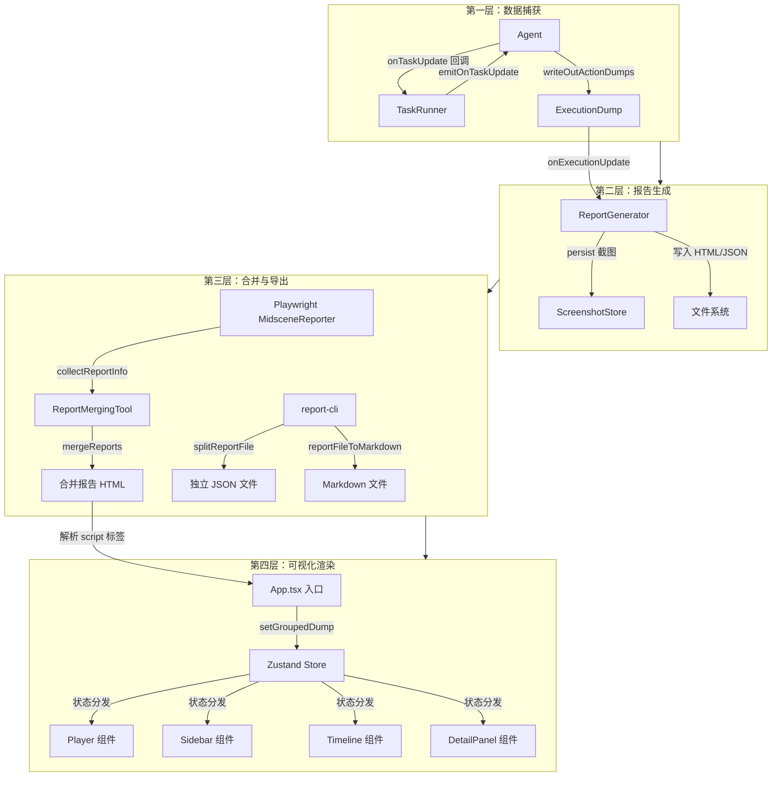
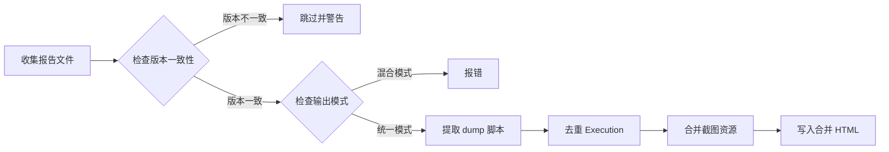
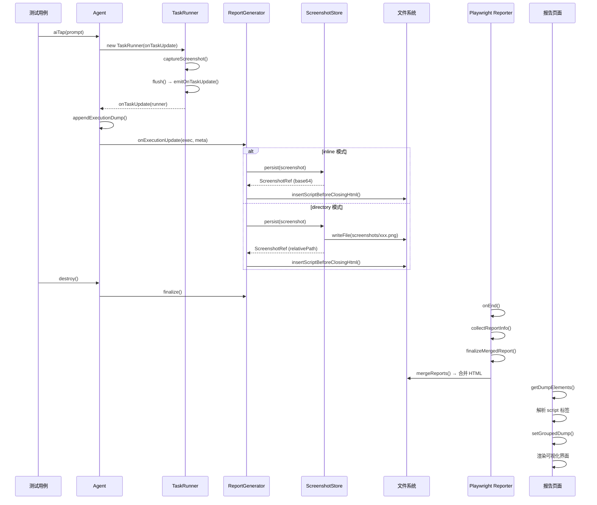

# Midscene 报告系统技术文档

> 版本：基于 Midscene monorepo 源码分析  
> 覆盖范围：从测试执行数据捕获到可视化报告渲染的全链路架构

---

## 目录

1. [架构总览](#1-架构总览)
2. [数据捕获层：Agent 与 TaskExecutor](#2-数据捕获层agent-与-taskexecutor)
3. [报告生成引擎：ReportGenerator](#3-报告生成引擎reportgenerator)
4. [截图管理：ScreenshotStore 与 ScreenshotItem](#4-截图管理screenshotstore-与-screenshotitem)
5. [数据序列化：ExecutionDump 与 ReportActionDump](#5-数据序列化executiondump-与-reportactiondump)
6. [HTML 工具集：流式解析与标签注入](#6-html-工具集流式解析与标签注入)
7. [多报告合并：ReportMergingTool](#7-多报告合并reportmergingtool)
8. [Playwright Reporter 集成](#8-playwright-reporter-集成)
9. [HTML 模板构建与注入](#9-html-模板构建与注入)
10. [前端可视化层](#10-前端可视化层)
11. [CLI 工具与辅助功能](#11-cli-工具与辅助功能)
12. [配置参考](#12-配置参考)

---

## 1. 架构总览

Midscene 报告系统采用四层架构，从测试执行时的数据捕获到最终的可视化渲染形成完整闭环：



### 核心文件索引

| 模块 | 文件路径 | 职责 |
|------|----------|------|
| Agent | [`packages/core/src/agent/agent.ts`](packages/core/src/agent/agent.ts) | 测试执行入口，管理 dump 数据 |
| TaskRunner | [`packages/core/src/task-runner.ts`](packages/core/src/task-runner.ts) | 任务执行器，触发截图与回调 |
| ReportGenerator | [`packages/core/src/report-generator.ts`](packages/core/src/report-generator.ts) | 报告生成引擎，写入 HTML |
| ScreenshotStore | [`packages/core/src/dump/screenshot-store.ts`](packages/core/src/dump/screenshot-store.ts) | 截图持久化管理 |
| ScreenshotItem | [`packages/core/src/screenshot-item.ts`](packages/core/src/screenshot-item.ts) | 截图数据封装，懒加载恢复 |
| 类型定义 | [`packages/core/src/types.ts`](packages/core/src/types.ts) | ExecutionDump、ReportActionDump 等核心类型 |
| HTML 工具 | [`packages/core/src/dump/html-utils.ts`](packages/core/src/dump/html-utils.ts) | 流式标签扫描、脚本生成 |
| 报告合并 | [`packages/core/src/report.ts`](packages/core/src/report.ts) | ReportMergingTool、报告拆分 |
| 报告工具函数 | [`packages/core/src/utils.ts`](packages/core/src/utils.ts) | reportHTMLContent、模板注入 |
| CLI 工具 | [`packages/core/src/report-cli.ts`](packages/core/src/report-cli.ts) | 报告拆分、Markdown 转换 |
| Playwright Reporter | [`packages/web-integration/src/playwright/reporter/index.ts`](packages/web-integration/src/playwright/reporter/index.ts) | Playwright 测试集成 |
| 构建配置 | [`apps/report/rsbuild.config.ts`](apps/report/rsbuild.config.ts) | 报告应用构建与模板注入 |
| 前端入口 | [`apps/report/src/App.tsx`](apps/report/src/App.tsx) | 报告页面入口，解析 dump 数据 |
| 状态管理 | [`apps/report/src/components/store/index.tsx`](apps/report/src/components/store/index.tsx) | Zustand 全局状态 |
| 动画脚本 | [`packages/visualizer/src/utils/replay-scripts.ts`](packages/visualizer/src/utils/replay-scripts.ts) | 回放动画脚本生成 |
| Player | [`packages/visualizer/src/component/player/index.tsx`](packages/visualizer/src/component/player/index.tsx) | 回放播放器 |
| Sidebar | [`apps/report/src/components/sidebar/index.tsx`](apps/report/src/components/sidebar/index.tsx) | 任务列表侧边栏 |
| Timeline | [`apps/report/src/components/timeline/index.tsx`](apps/report/src/components/timeline/index.tsx) | 时间轴组件 |
| DetailPanel | [`apps/report/src/components/detail-panel/index.tsx`](apps/report/src/components/detail-panel/index.tsx) | 详情面板 |

---

## 2. 数据捕获层：Agent 与 TaskExecutor

### 2.1 Agent 初始化与 ReportGenerator 创建

Agent 在构造时即创建 [`ReportGenerator`](packages/core/src/report-generator.ts:142) 实例，并注册 [`TaskRunner`](packages/core/src/task-runner.ts:34) 的 `onTaskUpdate` 回调：

```typescript
// packages/core/src/agent/agent.ts:254-368
constructor(interfaceInstance: InterfaceType, opts?: AgentOpt) {
  // ...
  this.reportGenerator = await ReportGenerator.create({
    reportFileName: opts?.reportFileName,
    outputMode: opts?.outputMode,        // 'inline' | 'directory'
    groupName: opts?.groupName,
    groupDescription: opts?.groupDescription,
    reportAttributes: opts?.reportAttributes,
    // ...
  });

  // 注册 TaskRunner 回调
  this.onDumpUpdate = (runner) => {
    this.writeOutActionDumps(runner.dump());
  };
}
```

### 2.2 TaskRunner 任务执行与回调触发

[`TaskRunner`](packages/core/src/task-runner.ts:34) 是任务执行的最小单元。每个 AI 操作（如 `aiTap`、`aiAssert`）都会创建一个 `TaskRunner` 实例：

```typescript
// packages/core/src/task-runner.ts:53-76
constructor(options: TaskRunnerInitOptions) {
  this.id = options.id;
  this.name = options.name;
  this.onTaskUpdate = options.onTaskUpdate; // 回调函数
  // ...
}

private async emitOnTaskUpdate(error?: TaskExecutionError): Promise<void> {
  if (this.onTaskUpdate) {
    await this.onTaskUpdate(this, error);
  }
}
```

**回调触发时机**：每次任务状态变更（开始、完成、失败）时，[`TaskRunner.flush()`](packages/core/src/task-runner.ts:200) 方法会调用 `emitOnTaskUpdate()`，进而触发 Agent 的 `writeOutActionDumps()`。

### 2.3 writeOutActionDumps：数据写入入口

```typescript
// packages/core/src/agent/agent.ts:492-503
writeOutActionDumps(executionDump?: ExecutionDump) {
  const exec = executionDump || this.appendExecutionDump(/*...*/);
  if (this.reportGenerator && exec) {
    const reportMeta = this.getReportMeta();
    const reportAttributes = this.getReportAttributes?.();
    this.reportGenerator.onExecutionUpdate(exec, reportMeta, reportAttributes);
  }
}
```

### 2.4 appendExecutionDump：执行数据累积

使用 `WeakMap<TaskRunner, number>` 跟踪每个 TaskRunner 对应的 execution 索引，支持追加和替换两种模式：

```typescript
// packages/core/src/agent/agent.ts:456-472
appendExecutionDump(execution: ExecutionDump, runner?: TaskRunner) {
  if (runner) {
    const index = this.runnerToExecutionIndex.get(runner);
    if (index !== undefined) {
      // 替换已有 execution
      this.dump.executions[index] = execution;
    } else {
      // 新增 execution
      this.runnerToExecutionIndex.set(runner, this.dump.executions.length);
      this.dump.executions.push(execution);
    }
  }
  return execution;
}
```

### 2.5 截图捕获时机

截图在 [`TaskRunner.captureScreenshot()`](packages/core/src/task-runner.ts:116) 中触发，通过 `getUiContext({ forceRefresh: true })` 获取最新页面状态。UI 上下文有 300ms 的缓存 TTL，`forceRefresh` 会跳过缓存：

```typescript
// packages/core/src/task-runner.ts:83-114
private async getUiContext(options?: { forceRefresh?: boolean }) {
  const now = Date.now();
  if (!options?.forceRefresh && this.lastUiContext &&
      now - this.lastUiContext.timestamp < 300) {
    return this.lastUiContext.context; // 缓存命中
  }
  const context = await this.interface.getUIContext(/*...*/);
  this.lastUiContext = { context, timestamp: now };
  return context;
}
```

截图通过 [`attachRecorderItem()`](packages/core/src/task-runner.ts:126) 附加到任务的 `recorder` 数组中，记录截图及其时间戳。

---

## 3. 报告生成引擎：ReportGenerator

[`ReportGenerator`](packages/core/src/report-generator.ts:87) 是报告系统的核心引擎，负责将执行数据写入 HTML 文件。

### 3.1 两种输出模式

| 模式 | 枚举值 | 截图存储方式 | 适用场景 |
|------|--------|-------------|----------|
| **Inline** | `'inline'` | Base64 内嵌在 HTML 的 `<script type="midscene-image">` 标签中 | 单文件分发，文件较大 |
| **Directory** | `'directory'` | 截图写入 `screenshots/` 子目录，HTML 中引用相对路径 | 多截图场景，文件较小 |

### 3.2 核心方法

#### create()：工厂方法

```typescript
// packages/core/src/report-generator.ts:142-175
static async create(options: ReportGeneratorOptions): Promise<ReportGenerator> {
  const generator = new ReportGenerator(options);
  await generator.hydrateStateFromExistingReport(); // 恢复已有状态
  return generator;
}
```

#### onExecutionUpdate()：追加写入

采用**追加写入（append-only）**策略，每次执行更新都在 HTML 文件末尾追加一个新的 `<script type="midscene_web_dump">` 标签：

```typescript
// packages/core/src/report-generator.ts:177-189
onExecutionUpdate(
  execution: ExecutionDump,
  reportMeta: ReportMeta,
  reportAttributes?: ReportAttributes,
) {
  this.writeQueue = this.writeQueue.then(async () => {
    await this.doWriteExecution(execution, reportMeta, reportAttributes);
  });
}
```

**关键设计**：使用 Promise 链 (`writeQueue`) 保证写入顺序，避免并发写入导致文件损坏。

#### doWriteExecution()：分发写入

```typescript
// packages/core/src/report-generator.ts:230-250
private async doWriteExecution(
  execution: ExecutionDump,
  reportMeta: ReportMeta,
  reportAttributes?: ReportAttributes,
) {
  this.mergeReportAttributes(reportAttributes);
  if (this.outputMode === 'inline') {
    await this.writeInlineExecution(execution, reportMeta);
  } else {
    await this.writeDirectoryExecution(execution, reportMeta);
  }
}
```

#### writeInlineExecution()：内联模式写入

1. 将截图 Base64 数据写入 `<script type="midscene-image">` 标签
2. 将执行数据序列化为 JSON 写入 `<script type="midscene_web_dump">` 标签
3. 使用 [`insertScriptBeforeClosingHtml()`](packages/core/src/utils.ts:112) 在 `</html>` 前追加

#### writeDirectoryExecution()：目录模式写入

1. 通过 [`ScreenshotStore.persist()`](packages/core/src/dump/screenshot-store.ts:153) 将截图写入 `screenshots/` 目录
2. 将执行数据（含截图文件路径引用）写入 `<script type="midscene_web_dump">` 标签
3. 首次写入时注入 `<base>` 标签修复脚本，确保相对路径正确解析

#### finalize()：报告完成

```typescript
// packages/core/src/report-generator.ts:195-210
async finalize(): Promise<string | undefined> {
  await this.writeQueue; // 等待所有写入完成
  this.printReportPath('Finalized');
  return this.reportPath;
}
```

### 3.3 报告文件命名

[`validateReportFileName()`](packages/core/src/report-generator.ts:420) 强制文件名不能包含路径分隔符或非法字符，确保安全性。文件名自动添加 `.html` 后缀。

### 3.4 状态恢复机制

[`hydrateStateFromExistingReport()`](packages/core/src/report-generator.ts:265) 在创建时检查报告文件是否已存在，若存在则恢复已有的截图引用和报告属性，支持增量追加。

---

## 4. 截图管理：ScreenshotStore 与 ScreenshotItem

### 4.1 ScreenshotItem：截图数据封装

[`ScreenshotItem`](packages/core/src/screenshot-item.ts:35) 封装单张截图的完整生命周期：

```typescript
// packages/core/src/screenshot-item.ts:35-49
export class ScreenshotItem {
  public readonly id: string;
  public readonly capturedAt: number;
  private _base64?: string;           // 内存中的 Base64 数据
  private persistedFilePath?: string;  // 持久化后的文件路径
  private persistedInlinePath?: string; // 内联 HTML 路径
  // ...
}
```

**懒加载恢复机制**：当 Base64 数据被释放后（通过 `markPersistedInline()` 或 `markPersistedToPath()`），再次访问 `base64` getter 时会自动从文件或 HTML 中恢复：

```typescript
// packages/core/src/screenshot-item.ts:75-123
get base64(): string {
  if (this._base64) return this._base64;

  if (this.persistedFilePath) {
    return loadFromFile();  // 从 screenshots/ 目录读取
  }
  if (this.persistedInlinePath) {
    return loadFromInline(); // 从 HTML 的 midscene-image 标签读取
  }
  throw new Error('Screenshot data is not available');
}
```

### 4.2 ScreenshotStore：截图持久化管理

[`ScreenshotStore`](packages/core/src/dump/screenshot-store.ts:124) 管理截图的持久化写入：

```typescript
// packages/core/src/dump/screenshot-store.ts:153-181
async persist(screenshot: ScreenshotItem): Promise<ScreenshotRef> {
  if (this.outputMode === 'inline') {
    // 内联模式：通过回调写入 Base64
    await this.writeInlineImage?.(screenshot.id, screenshot.rawBase64);
    return screenshot.markPersistedInline(this.reportPath);
  } else {
    // 目录模式：写入 screenshots/ 目录
    const filePath = path.join(this.screenshotDir, `${screenshot.id}.png`);
    await fs.promises.writeFile(filePath, screenshot.rawBase64);
    return screenshot.markPersistedToPath(filePath, this.reportPath);
  }
}
```

**去重机制**：通过 `writtenInlineIds` 和 `writtenFileIds` 两个 `Set` 跟踪已写入的截图，避免重复写入。

### 4.3 ScreenshotRef：截图引用格式

```typescript
// packages/core/src/dump/screenshot-store.ts:7-14
export interface ScreenshotRef {
  id: string;
  mimeType: string;
  base64?: string;       // 内联模式
  relativePath?: string; // 目录模式
}
```

---

## 5. 数据序列化：ExecutionDump 与 ReportActionDump

### 5.1 ExecutionDump：单次执行数据

[`ExecutionDump`](packages/core/src/types.ts:502) 表示一次 AI 操作的完整记录：

```typescript
// packages/core/src/types.ts:502-588
export class ExecutionDump implements IExecutionDump {
  id: string;                    // 唯一标识
  logTime: number;               // 执行时间戳
  name: string;                  // 操作名称
  tasks: ExecutionTask[];        // 任务列表
  aiActContext?: string;         // AI 操作上下文
  // ...

  collectScreenshots(): ScreenshotItem[] {
    // 递归收集所有任务中的截图
  }

  static fromSerializedString(serialized: string): ExecutionDump {
    // 从 JSON 字符串反序列化
  }
}
```

**自定义 JSON 序列化**：使用 [`replacerForDumpSerialization`](packages/core/src/types.ts:464) 和 [`reviverForDumpDeserialization`](packages/core/src/types.ts:486) 处理 `ScreenshotItem` 等特殊类型的序列化与反序列化。

### 5.2 ReportActionDump：顶层报告数据

[`ReportActionDump`](packages/core/src/types.ts:759) 是报告文件的顶层数据结构：

```typescript
// packages/core/src/types.ts:759-960
export class ReportActionDump implements IReportActionDump {
  sdkVersion: string;              // SDK 版本
  groupName: string;               // 分组名称
  groupDescription?: string;       // 分组描述
  executions: ExecutionDump[];     // 执行记录列表
  modelBriefs: ModelBrief[];       // 模型信息
  deviceType?: string;             // 设备类型

  serialize(): string { /* 标准 JSON 序列化 */ }

  serializeWithInlineScreenshots(indents?: number): string {
    // 将截图 Base64 内嵌到 JSON 中
  }

  static fromSerializedString(serialized: string): ReportActionDump {
    // 从 JSON 字符串反序列化
  }

  serializeToFiles(basePath: string): void {
    // 序列化到独立文件（JSON + 截图目录）
  }

  static fromFilesAsInlineJson(basePath: string): string {
    // 从独立文件恢复为内联 JSON
  }
}
```

### 5.3 ReportMeta：报告元信息

```typescript
// packages/core/src/types.ts:713-719
export interface ReportMeta {
  groupName: string;
  groupDescription?: string;
  sdkVersion: string;
  modelBriefs: ModelBrief[];
  deviceType?: string;
}
```

### 5.4 ModelBrief：模型信息

```typescript
// packages/core/src/types.ts:739-754
export interface ModelBrief {
  intent: string;          // 模型用途（如 'vision'、'planning'）
  name: string;            // 模型名称
  modelDescription: string; // 模型描述
}
```

---

## 6. HTML 工具集：流式解析与标签注入

[`html-utils.ts`](packages/core/src/dump/html-utils.ts) 提供了一套高效的 HTML 处理工具。

### 6.1 流式标签扫描

[`streamScanTags()`](packages/core/src/dump/html-utils.ts:26) 使用 64KB 分块流式读取，避免大文件内存溢出：

```typescript
// packages/core/src/dump/html-utils.ts:26-92
export function streamScanTags(
  filePath: string,
  openTag: string,
  closeTag: string,
  onMatch: (content: string) => void,
): void {
  const fd = openSync(filePath, 'r');
  const buffer = Buffer.alloc(64 * 1024); // 64KB 块
  // 流式扫描标签内容...
}
```

### 6.2 Dump 脚本提取

| 函数 | 功能 |
|------|------|
| [`extractLastDumpScriptSync()`](packages/core/src/dump/html-utils.ts:148) | 提取最后一个 dump 脚本 |
| [`extractAllDumpScriptsSync()`](packages/core/src/dump/html-utils.ts:230) | 提取所有 dump 脚本 |
| [`streamDumpScriptsSync()`](packages/core/src/dump/html-utils.ts:249) | 流式遍历 dump 脚本 |

### 6.3 脚本标签生成

```typescript
// packages/core/src/dump/html-utils.ts:456-481
export function generateDumpScriptTag(
  jsonContent: string,
  attributes?: Record<string, string>,
): string {
  const attrString = attributes
    ? ' ' + Object.entries(attributes)
        .map(([k, v]) => `data-${k}="${v}"`)
        .join(' ')
    : '';
  return `<script type="midscene_web_dump"${attrString}>${jsonContent}</script>`;
}
```

### 6.4 报告 HTML 内容组装

[`reportHTMLContent()`](packages/core/src/utils.ts:142) 将 dump 数据包装为 script 标签并注入 HTML 模板：

```typescript
// packages/core/src/utils.ts:142-226
export function reportHTMLContent(
  dumpString: string,
  options?: { groupName?: string; groupDescription?: string; /* ... */ }
): string {
  const tpl = getReportTpl();
  const scriptTag = generateDumpScriptTag(dumpString, attributes);
  return insertContentBeforeClosingHtml(tpl, scriptTag);
}
```

### 6.5 高性能文件追加

[`insertScriptBeforeClosingHtml()`](packages/core/src/utils.ts:112) 使用 `truncate` + `append` 策略，避免读取整个文件：

```typescript
// packages/core/src/utils.ts:112-140
export function insertScriptBeforeClosingHtml(
  filePath: string,
  scriptContent: string,
): void {
  // 1. 打开文件
  // 2. 从末尾向前搜索 </html> 位置
  // 3. truncate 到该位置
  // 4. 追加 script 内容 + </html>
}
```

---

## 7. 多报告合并：ReportMergingTool

[`ReportMergingTool`](packages/core/src/report.ts:79) 负责将多个测试用例的报告合并为单一 HTML 文件。

### 7.1 合并流程



### 7.2 核心方法

#### append()：收集报告信息

```typescript
// packages/core/src/report.ts:92-109
public append(reportInfo: ReportFileWithAttributes) {
  this.reportInfos.push(reportInfo);
}
```

#### mergeReports()：执行合并

```typescript
// packages/core/src/report.ts:140-314
public mergeReports(outputPath: string): void {
  // 1. 检查版本一致性
  // 2. 检查输出模式一致性（不能混合 inline 和 directory）
  // 3. 提取所有 dump 脚本
  // 4. 去重 execution（按 id 保留最新）
  // 5. 合并截图资源
  // 6. 写入合并后的 HTML
}
```

#### dedupeExecutionsKeepLatest()：去重策略

```typescript
// packages/core/src/report.ts:50-60
export function dedupeExecutionsKeepLatest(
  executions: ExecutionDump[]
): ExecutionDump[] {
  const map = new Map<string, ExecutionDump>();
  for (const exec of executions) {
    map.set(exec.id, exec); // 后出现的覆盖先出现的
  }
  return Array.from(map.values());
}
```

### 7.3 报告拆分

[`splitReportHtmlByExecution()`](packages/core/src/report.ts:462) 反向操作，将合并报告拆分为独立的 execution JSON 文件，同时将内联截图外部化。

---

## 8. Playwright Reporter 集成

[`MidsceneReporter`](packages/web-integration/src/playwright/reporter/index.ts:27) 实现 Playwright 的 `Reporter` 接口，在测试结束时自动收集和合并报告。

### 8.1 两种报告模式

| 模式 | 行为 |
|------|------|
| `merged` | 所有测试用例合并为单个报告文件 |
| `separate` | 每个测试用例生成独立报告文件 |

### 8.2 报告收集

```typescript
// packages/web-integration/src/playwright/reporter/index.ts:108-158
private collectReportInfo(test: TestCase, result: TestResult) {
  // 1. 从 test annotations 中提取报告文件路径
  const reportAnnotations = test.annotations.filter(
    (a) => a.type === 'midscene-report'
  );
  // 2. 验证文件存在性
  // 3. 构建 ReportFileWithAttributes 列表
}
```

### 8.3 报告输出

```typescript
// packages/web-integration/src/playwright/reporter/index.ts:253-262
async onEnd() {
  if (this.mode === 'merged') {
    this.finalizeMergedReport();
  } else {
    this.finalizeSeparateReports();
  }
}
```

### 8.4 配置方式

在 `playwright.config.ts` 中配置：

```typescript
export default defineConfig({
  reporter: [
    ['@midscene/web/playwright/reporter', {
      type: 'merged',           // 'merged' | 'separate'
      outputPath: './reports',  // 输出目录
    }]
  ],
});
```

---

## 9. HTML 模板构建与注入

### 9.1 构建流程

报告应用（[`apps/report`](apps/report/)）使用 Rsbuild 构建，通过自定义插件将构建产物注入到 `@midscene/core` 的发行版中：

```mermaid
flowchart TB
    A[apps/report 源码] -->|rsbuild build| B[dist/index.html]
    B -->|copyReportTemplate 插件| C[读取 dist/index.html]
    C -->|替换 REPLACE_ME_WITH_REPORT_HTML| D[@midscene/core dist JS 文件]
    D -->|标记 REPLACE_ME_WITH_REPORT_HTML_REPLACED| E[后续构建跳过替换]
```

### 9.2 copyReportTemplate 插件

```typescript
// apps/report/rsbuild.config.ts:30-108
const copyReportTemplate = () => ({
  setup(api) {
    api.onAfterBuild(({ compiler }) => {
      // 1. 读取构建产物 dist/index.html
      const reportHtml = fs.readFileSync(
        path.join(__dirname, 'dist/index.html'), 'utf-8'
      );
      // 2. 在 @midscene/core 的 dist 文件中查找并替换
      const coreDistDir = path.join(__dirname, '../../packages/core/dist');
      // 3. 替换 REPLACE_ME_WITH_REPORT_HTML 为实际 HTML
      // 4. 标记为 REPLACE_ME_WITH_REPORT_HTML_REPLACED 防止重复替换
    });
  },
});
```

### 9.3 模板占位符机制

[`getReportTpl()`](packages/core/src/utils.ts:84) 在开发环境返回 `__DEV_REPORT_PATH__` 指向的文件，在生产环境返回 `REPLACE_ME_WITH_REPORT_HTML` 占位符：

```typescript
// packages/core/src/utils.ts:84-91
export function getReportTpl() {
  if (process.env.__DEV_REPORT_PATH__) {
    return fs.readFileSync(process.env.__DEV_REPORT_PATH__, 'utf-8');
  }
  return 'REPLACE_ME_WITH_REPORT_HTML';
}
```

### 9.4 报告 HTML 结构

最终生成的报告 HTML 结构：

```html
<!doctype html>
<html>
  <head>
    <!-- 内联 CSS 和 JS（rsbuild 构建产物） -->
  </head>
  <body>
    <div id="root"></div>
    <!-- 报告数据 -->
    <script type="midscene_web_dump" data-group-id="..." data-sdk-version="...">
      {"sdkVersion":"...","executions":[...]}
    </script>
    <!-- 内联截图（仅 inline 模式） -->
    <script type="midscene-image" data-image-id="...">
      iVBORw0KGgo...
    </script>
  </body>
</html>
```

---

## 10. 前端可视化层

### 10.1 入口与数据解析

[`App.tsx`](apps/report/src/App.tsx:354) 是报告页面的入口组件：

```typescript
// apps/report/src/App.tsx:364-439
function getDumpElements(): PlaywrightTasks[] {
  // 1. 查找所有 script[type="midscene_web_dump"]
  const dumpElements = document.querySelectorAll('script[type="midscene_web_dump"]');
  // 2. 按 data-group-id 分组
  // 3. 解析 JSON 内容
  // 4. 合并同组 dump，去重 execution
  // 5. 返回 PlaywrightTasks[] 数组
}
```

### 10.2 状态管理

[`useExecutionDump`](apps/report/src/components/store/index.tsx:91) 是基于 Zustand 的全局状态 store：

```typescript
// apps/report/src/components/store/index.tsx:91-248
export const useExecutionDump = create<DumpStoreType>((set, get) => ({
  dump: null,                    // PlaywrightTasks[] 分组数据
  activeTask: null,              // 当前选中的任务
  activeExecution: null,         // 当前选中的执行记录
  replayAllMode: false,          // 是否全量回放模式
  allExecutionAnimation: null,   // 全量回放动画脚本
  insightWidth: 0,               // 洞察区域宽度
  insightHeight: 0,              // 洞察区域高度
  sdkVersion: '',                // SDK 版本
  modelBriefs: [],               // 模型信息

  setGroupedDump: async (dump) => {
    // 设置分组数据，提取元信息，默认进入 replay-all 模式
  },

  setActiveTask: (task) => {
    // 设置当前任务，查找父 execution，生成动画脚本
  },
}));
```

### 10.3 动画脚本生成

[`replay-scripts.ts`](packages/visualizer/src/utils/replay-scripts.ts) 将 `ExecutionDump` 转换为播放器可用的动画脚本：

```typescript
// packages/visualizer/src/utils/replay-scripts.ts:47-67
export interface AnimationScript {
  type: 'img' | 'insight' | 'clear-insight' | 'pointer' | 'spinning-pointer' | 'sleep';
  img?: string;              // 截图 Base64（懒加载）
  camera?: CameraState;      // 相机状态（视口位置）
  highlightElement?: Rect;   // 高亮元素区域
  duration: number;          // 持续时间（帧数）
  taskId?: string;           // 关联任务 ID
}
```

**关键函数**：

| 函数 | 功能 |
|------|------|
| [`generateAnimationScripts()`](packages/visualizer/src/utils/replay-scripts.ts:331) | 为单个 execution 生成动画脚本 |
| [`allScriptsFromDump()`](packages/visualizer/src/utils/replay-scripts.ts:273) | 为所有 execution 生成动画脚本（replay-all 模式） |
| [`cameraStateForRect()`](packages/visualizer/src/utils/replay-scripts.ts:78) | 计算元素高亮时的相机视口 |
| [`extractDumpMetaInfo()`](packages/visualizer/src/utils/replay-scripts.ts:267) | 提取元信息（宽高、版本、模型） |

**懒加载优化**：`img` 属性使用 `Object.defineProperty` 延迟读取 Base64，避免初始化时加载所有截图：

```typescript
// packages/visualizer/src/utils/replay-scripts.ts:412-420
Object.defineProperty(script, 'img', {
  get() {
    // 首次访问时才读取 Base64
    const value = screenshotItem?.base64;
    Object.defineProperty(script, 'img', { value, writable: true });
    return value;
  },
  configurable: true,
});
```

### 10.4 Player 组件

[`Player`](packages/visualizer/src/component/player/index.tsx:55) 是核心回放播放器：

**功能特性**：
- 帧级播放控制（播放/暂停/逐帧）
- 多档播放速度（0.5x、1x、1.5x、2x）
- 章节标记（Chapter Markers）快速跳转
- 全屏模式
- 视频导出（通过 `handleExportVideo`）
- 键盘快捷键（空格播放/暂停，左右箭头逐帧）
- 进度条拖拽定位

**帧映射**：通过 [`FrameMap`](packages/visualizer/src/component/player/index.tsx:83) 将帧位置映射到对应的 `AnimationScript` 和任务 ID：

```typescript
// packages/visualizer/src/component/player/index.tsx:30-46
function deriveTaskId(
  frame: number,
  frameMap: FrameMap,
): string | undefined {
  // 根据当前帧位置查找对应的 taskId
}
```

### 10.5 Sidebar 组件

[`Sidebar`](apps/report/src/components/sidebar/index.tsx:44) 展示任务列表：

**表格列**：
| 列 | 内容 |
|----|------|
| Type | 任务类型图标（Planning、Action、Assert 等） |
| Time | 执行时间 |
| Intent | 操作意图 |
| Model | 使用的模型 |
| Prompt | 提示词（截断显示） |
| Cached | 缓存命中标记 |
| Completion | 完成状态 |

**交互功能**：
- 点击行切换当前任务
- 键盘导航（Cmd+Up/Down）
- 回放高亮（`playingTaskId` 驱动）
- 悬停预览（`setHoverPreviewConfig`）
- Pro 模式切换（显示模型调用详情）
- Token 用量统计（按模型分组）

### 10.6 Timeline 组件

[`Timeline`](apps/report/src/components/timeline/index.tsx:440) 是基于 Canvas 的时间轴组件：

**核心特性**：
- Canvas 渲染截图缩略图
- 视口感知懒加载（仅加载可见区域）
- 缩略图降采样优化
- 网格线与时间标签
- 高亮/悬停遮罩层
- 指针事件导航（点击跳转任务）

**渲染流程**：

```typescript
// apps/report/src/components/timeline/index.tsx:252-364
const drawAll = () => {
  // 1. 清空画布
  // 2. 绘制网格线和时间标签
  // 3. 遍历可见区域的 TimelineItem
  // 4. 绘制截图缩略图（含降采样）
  // 5. 绘制高亮遮罩（当前播放位置）
  // 6. 绘制悬停遮罩（鼠标位置）
};
```

### 10.7 DetailPanel 组件

[`DetailPanel`](apps/report/src/components/detail-panel/index.tsx:118) 展示任务详情：

**四种视图模式**（Tab 切换）：

| 视图 | 内容 |
|------|------|
| **Replay** | Player 回放 + Blackboard 元素高亮 |
| **Markdown** | 执行步骤的 Markdown 渲染，支持 ZIP 下载 |
| **Screenshots** | 截图列表（上下文截图 + recorder 截图） |
| **JSON View** | 原始 JSON 数据展示 |

**截图展示**：[`ScreenshotDisplay`](apps/report/src/components/detail-panel/index.tsx:25) 组件支持截图与元素高亮的叠加显示。

---

## 11. CLI 工具与辅助功能

### 11.1 report-cli

[`report-cli.ts`](packages/core/src/report-cli.ts) 提供命令行工具：

#### splitReportFile()：报告拆分

```typescript
// packages/core/src/report-cli.ts:167-185
export function splitReportFile(options: SplitReportFileOptions): {
  // 将合并报告拆分为独立的 execution JSON 文件
  // 输出：execution_0.json, execution_1.json, ...
}
```

#### reportFileToMarkdown()：Markdown 转换

```typescript
// packages/core/src/report-cli.ts:187-201
export async function reportFileToMarkdown(
  htmlPath: string,
  outputDir: string,
): Promise<void> {
  // 将报告转换为 Markdown 格式
  // 截图保存为独立文件
}
```

### 11.2 CLI Report Session

[`cli-report-session.ts`](packages/shared/src/mcp/cli-report-session.ts) 为 MCP/CLI 工具提供会话级报告管理，支持 JSON 持久化。

---

## 12. 配置参考

### 12.1 Agent 报告配置

```typescript
interface AgentOpt {
  reportFileName?: string;       // 报告文件名（不含路径）
  outputMode?: 'inline' | 'directory'; // 输出模式
  groupName?: string;            // 分组名称
  groupDescription?: string;     // 分组描述
  reportAttributes?: ReportAttributes; // 自定义属性
}
```

### 12.2 Playwright Reporter 配置

```typescript
// playwright.config.ts
{
  reporter: [
    ['@midscene/web/playwright/reporter', {
      type: 'merged',              // 'merged' | 'separate'
      outputPath: './midscene-reports', // 输出目录
    }]
  ]
}
```

### 12.3 报告输出模式对比

| 特性 | Inline 模式 | Directory 模式 |
|------|------------|---------------|
| 文件数量 | 单个 HTML | HTML + screenshots/ 目录 |
| 截图存储 | Base64 内嵌 | 独立 PNG 文件 |
| 文件大小 | 较大 | 较小 |
| 可移植性 | 高（单文件） | 中（需保持目录结构） |
| 适用场景 | 少量截图 | 大量截图 |

### 12.4 环境变量

| 变量 | 用途 |
|------|------|
| `__DEV_REPORT_PATH__` | 开发模式下指定报告模板路径 |
| `MIDSCENE_MODEL_BASE_URL` | AI 测试模型服务地址 |

---

## 附录：数据流时序图



---

> **文档维护说明**：本文档基于 Midscene monorepo 源码分析生成。当报告系统相关代码发生变更时，请同步更新本文档。关键变更点包括：`ReportGenerator` 输出模式、`ReportActionDump` 序列化格式、前端组件接口、构建流程等。