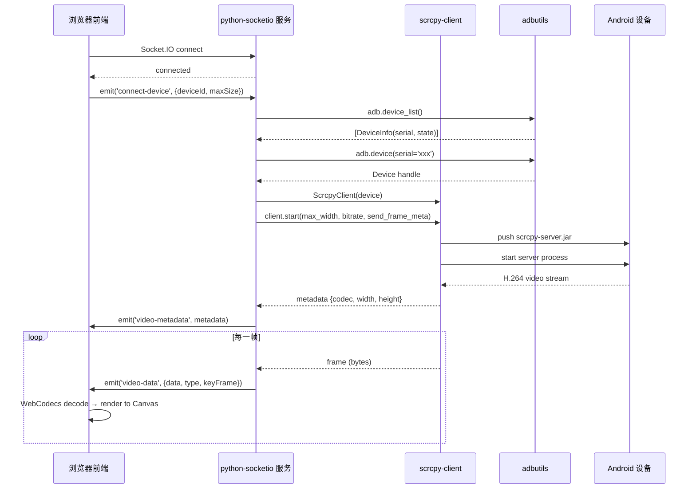
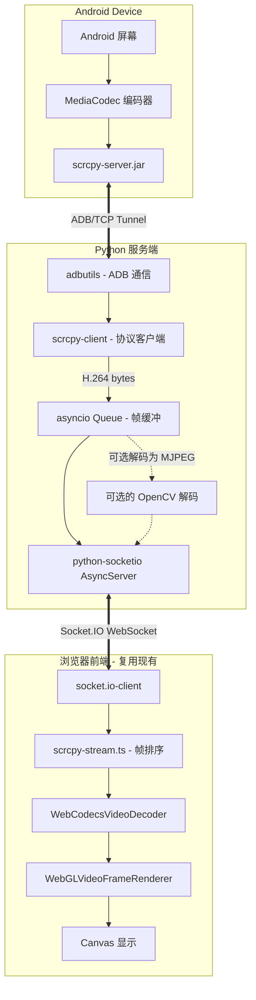

# Midscene Android 投屏：Python 实现方案

## 概述

本文档描述如何在 Python 中复刻 Midscene Android Playground 的 scrcpy 投屏功能。当前 TypeScript 实现基于 `@yume-chan/*` 生态的 scrcpy 客户端 + WebCodecs 硬件解码 + Socket.IO 传输，Python 方案需要找到各层对应的等效库。

---

## 1. TypeScript → Python 库映射总览

```
┌─────────────────────────────────────────────────────────────────┐
│                    TypeScript 实现                              │
│  @yume-chan/adb ──→ ADB 传输层                                  │
│  @yume-chan/adb-scrcpy ──→ scrcpy 协议客户端                    │
│  @yume-chan/scrcpy ──→ 协议常量和类型                            │
│  @yume-chan/scrcpy-decoder-webcodecs ──→ H.264 解码 + 渲染      │
│  @yume-chan/stream-extra ──→ 流工具                              │
│  socket.io / socket.io-client ──→ WebSocket 传输                │
└─────────────────────────────────────────────────────────────────┘
                              │
                              ▼
┌─────────────────────────────────────────────────────────────────┐
│                    Python 等效方案                               │
│  adbutils / pure-python-adb ──→ ADB 传输层                      │
│  scrcpy-client ──→ scrcpy 协议客户端                             │
│  opencv-python / av (PyAV) ──→ H.264 解码                       │
│  asyncio ──→ 流管理                                              │
│  python-socketio + aiohttp ──→ WebSocket 传输                   │
└─────────────────────────────────────────────────────────────────┘
```

---

## 2. 方案对比：两条实现路径

### 2.1 方案 A：`scrcpy-client`（推荐，纯 Python）

直接使用 Python scrcpy 客户端库，封装了 ADB 通信和 scrcpy 协议，接口与 `@yume-chan/adb-scrcpy` 高度相似。

| 维度 | 说明 |
|------|------|
| 库名 | `scrcpy-client` |
| 安装 | `pip install scrcpy-client` |
| 底层依赖 | `adbutils`（自动安装） |
| 优势 | API 与 TypeScript 实现结构相似，上手快 |
| 劣势 | 文档较少，需阅读源码；依赖 `pure-python-adb` |

### 2.2 方案 B：`adbutils` + scrcpy CLI（稳定但重）

直接调用官方 `scrcpy` 命令行工具，通过管道捕获 H.264 流，用 `adbutils` 管理设备。

| 维度 | 说明 |
|------|------|
| 库名 | `adbutils` + 系统安装 `scrcpy` |
| 安装 | `pip install adbutils` + `brew install scrcpy`（macOS） |
| 优势 | 使用官方 scrcpy，稳定可靠 |
| 劣势 | 需预装 scrcpy 二进制，增加部署复杂度 |

---

## 3. Python 库详细说明

### 3.1 ADB 通信层

#### `adbutils`（推荐）

```python
pip install adbutils
```

- **仓库**: https://github.com/openatx/adbutils
- **职责**: 设备发现、文件推送、Shell 命令、TCP 转发等
- **对应 TypeScript**: `@yume-chan/adb` 的 `AdbServerClient` + `Adb`

**关键 API**:

```python
from adbutils import adb

# 列出设备（等价于 AdbServerClient.getDevices()）
devices = adb.device_list()
for d in devices:
    print(d.serial, d.state)  # 'online' | 'offline'

# 连接指定设备（等价于 Adb.createTransport({serial})）
device = adb.device(serial="xxx")

# 推送文件（等价于 AdbScrcpyClient.pushServer()）
device.push(local_path, remote_path)

# 执行 Shell（等价于 adb.subprocess.spawn()）
result = device.shell("cmd")
```

#### `pure-python-adb`（备选）

```python
pip install pure-python-adb
```

- **仓库**: https://github.com/Swind/pure-python-adb
- **职责**: 纯 Python 实现的 ADB 协议，无需系统安装 `adb`
- **对应 TypeScript**: 同 `@yume-chan/adb`
- **注意**: `scrcpy-client` 内部也使用了 `pure-python-adb`

---

### 3.2 scrcpy 协议客户端

#### `scrcpy-client`（推荐）

```python
pip install scrcpy-client
```

- **仓库**: https://github.com/leng-yue/py-scrcpy-client
- **职责**: scrcpy 协议实现，包括推送 server、启动服务、获取视频流、触控注入
- **对应 TypeScript**: `@yume-chan/adb-scrcpy` + `@yume-chan/scrcpy`

**关键 API**:

```python
from scrcpy_client import ScrcpyClient
from adbutils import adb

# 获取设备
device = adb.device(serial="xxx")

# 创建 scrcpy 客户端
client = ScrcpyClient(device)

# 启动（内部自动 push server）
# 对应 TypeScript: await AdbScrcpyClient.start(adb, DefaultServerPath, options)
client.start(
    max_width=1024,          # 对应 maxSize: 1024
    bitrate=2_000_000,       # 对应 videoBitRate: 2000000
    send_frame_meta=True,    # 对应 sendFrameMeta: true
    control=True,            # 对应 control: true
    # 注意: scrcpy-client 不直接支持 sendFrameMeta
    # 可能需要 fork 或配置底层参数
)

# 获取视频流（对应 scrcpyClient.videoStream）
# scrcpy-client 提供的是帧迭代器/generator
for frame in client.stream():
    # frame 是 bytes (原始 H.264 NAL 单元 或 解码后的图片)
    # 可以进一步用 OpenCV 解码
    pass
```

**与 TypeScript 实现的差异**:

| 特性 | TypeScript (`@yume-chan`) | Python (`scrcpy-client`) |
|------|---------------------------|--------------------------|
| 视频流返回 | `videoStream` Promise → `{metadata, stream: ReadableStream}` | 直接返回帧迭代器 |
| sendFrameMeta | 原生支持配置/数据帧区分 | 需额外配置（可能不支持） |
| 解码 | WebCodecs（硬件加速） | 库内自带 FFmpeg/OpenCV 解码 |
| 控制 | 内置触控协议 | 内置触控协议 |

> **关键提示**: `sendFrameMeta: true` 是 TypeScript 实现中非常重要的配置。scrcpy 默认发送裸 H.264 NAL 单元，`sendFrameMeta` 会在每帧前添加元信息头（帧类型、PTS 等），使前端能够区分配置帧和数据帧。Python 端需要确保该选项可用。

---

### 3.3 H.264 视频解码

在 TypeScript 中，解码发生在前端浏览器（`WebCodecsVideoDecoder` → `WebGLVideoFrameRenderer`）。Python 方案中解码发生在服务端，然后以 MJPEG/图片帧的形式发送给前端。

#### `opencv-python`（推荐，简单高效）

```python
pip install opencv-python
```

```python
import cv2
import numpy as np

# 从 H.264 字节流解码
# 方式 1: 使用 cv2.VideoCapture + pipe
# 方式 2: 手动拼接 NAL 单元后用 cv2.imdecode

# 方式 2 示例（适用于 scrcpy 原始帧）
def decode_h264_frame(frame_bytes: bytes) -> np.ndarray | None:
    """将 H.264 裸流帧解码为 BGR/RGB numpy 数组"""
    # frame_bytes 是单帧 H.264 数据
    # 需要先转换为可解码的格式
    arr = np.frombuffer(frame_bytes, dtype=np.uint8)
    img = cv2.imdecode(arr, cv2.IMREAD_COLOR)
    return img
```

#### `av` / PyAV（备选，更底层）

```python
pip install av
```

```python
import av

codec = av.CodecContext.create('h264', 'r')
# 逐帧解码
packets = codec.parse(frame_bytes)
for packet in packets:
    frames = codec.decode(packet)
    for frame in frames:
        img = frame.to_ndarray(format='bgr24')
```

**对比**:

| 解码器 | H.264 解码 | CPU 占用 | 解码延迟 | 适用场景 |
|--------|-----------|---------|---------|---------|
| OpenCV | ✅ 需手动处理 NAL | 中 | 低 | 逐帧解码后发送 MJPEG |
| PyAV | ✅ 直接支持 | 低 | 低 | 需要精确控制解码流程 |
| FFmpeg subprocess | ✅ 完整支持 | 中 | 中 | 转码为 MJPEG 流 |

---

### 3.4 WebSocket / 传输层

TypeScript 使用 `socket.io` 在 Node.js 服务端和浏览器之间传输视频帧。Python 同样可以使用 `python-socketio`。

#### `python-socketio` + `aiohttp`（推荐）

```python
pip install python-socketio aiohttp
```

```python
import socketio
from aiohttp import web

# 创建 Socket.IO 服务器
sio = socketio.AsyncServer(
    async_mode='aiohttp',
    cors_allowed_origins='*',
    max_http_buffer_size=10_000_000,  # 10MB，视频帧较大
)

app = web.Application()
sio.attach(app)

@sio.event
async def connect(sid, environ):
    print(f'Client connected: {sid}')

@sio.event
async def disconnect(sid):
    print(f'Client disconnected: {sid}')

@sio.event
async def connect_device(sid, data):
    """对应 TypeScript socket.on('connect-device')"""
    device_id = data.get('deviceId')
    max_size = data.get('maxSize', 1024)

    # 1. 连接设备
    device = adb.device(serial=device_id)

    # 2. 启动 scrcpy
    client = ScrcpyClient(device)
    client.start(max_width=max_size, bitrate=2_000_000)

    # 3. 发送视频元数据（对应 socket.emit('video-metadata', metadata)）
    await sio.emit('video-metadata', {
        'codec': 'h264',
        'width': client.width,
        'height': client.height,
    }, to=sid)

    # 4. 流式发送视频帧（对应 socket.emit('video-data', {...})）
    for frame in client.stream():
        await sio.emit('video-data', {
            'data': frame,        # 二进制帧数据
            'type': 'data',       # 'configuration' | 'data'
            'timestamp': time.time() * 1000,
            'keyFrame': False,    # 需从 scrcpy-client 获取
        }, to=sid)
```

#### `websockets`（备选，纯 WebSocket 无 Socket.IO）

```python
pip install websockets
```

如果前端也切换为纯 WebSocket，可以不依赖 Socket.IO 协议。

---

### 3.5 流管理工具

TypeScript 使用 `@yume-chan/stream-extra` 的 `ReadableStream`。Python 使用 `asyncio` 原生支持。

```python
import asyncio
from asyncio import Queue

# 等价于 TypeScript 的 ReadableStream + TransformStream
async def video_stream_producer(client, queue: Queue):
    """生产者：从 scrcpy 读取帧，放入队列"""
    for frame in client.stream():
        await queue.put(frame)
    await queue.put(None)  # 结束信号

async def video_stream_consumer(queue: Queue):
    """消费者：从队列读取帧，通过 Socket.IO 发送"""
    while True:
        frame = await queue.get()
        if frame is None:
            break
        # 发送帧...
```

---

## 4. 完整调用链路（Python 版）



---

## 5. 实现步骤详解

### 步骤 1: 安装依赖

```bash
pip install scrcpy-client python-socketio aiohttp opencv-python
```

### 步骤 2: 设备发现

对比 TypeScript 实现：

```typescript
// TypeScript: packages/android-playground/src/scrcpy-server.ts:173-180
const devices = await client.getDevices();
const formattedDevices = devices.map((device) => ({
  serial: device.serial,
  state: device.state,
  ...
}));
```

Python 等效：

```python
from adbutils import adb

async def get_devices_list():
    devices = adb.device_list()
    return [
        {
            'serial': d.serial,
            'state': d.state,  # 'device' | 'offline' | 'unauthorized'
            'model': d.prop.model if hasattr(d, 'prop') else '',
        }
        for d in devices
    ]
```

### 步骤 3: 启动 ADB 和连接设备

对比 TypeScript 实现：

```typescript
// TypeScript: scrcpy-server.ts:229-251
// adb start-server
await promiseExec('adb start-server');
this.adbClient = new AdbServerClient(
  new AdbServerNodeTcpConnector({host: '127.0.0.1', port: 5037})
);

// TypeScript: scrcpy-server.ts:255-301
const targetDeviceId = deviceId || this.currentDeviceId;
return new Adb(await client.createTransport({serial: targetDeviceId}));
```

Python 等效：

```python
from adbutils import adb

# adbutils 自动管理 adb server，无需手动 start-server
# 连接设备等价于 AdbServerClient + createTransport
device = adb.device(serial='xxx')
```

### 步骤 4: 启动 scrcpy 服务

对比 TypeScript 实现：

```typescript
// TypeScript: scrcpy-server.ts:304-376
const { AdbScrcpyClient, AdbScrcpyOptions3_3_3 } = await import('@yume-chan/adb-scrcpy');

// Push server
await AdbScrcpyClient.pushServer(adb, ReadableStream.from(createReadStream(serverBinPath)));

// Start
const scrcpyOptions = new AdbScrcpyOptions3_3_3({
  audio: false,
  control: true,
  maxSize: 1024,
  sendFrameMeta: true,
  videoBitRate: 2_000_000,
});
const scrcpyClient = await AdbScrcpyClient.start(adb, DefaultServerPath, scrcpyOptions);
```

Python 等效：

```python
from scrcpy_client import ScrcpyClient

client = ScrcpyClient(device)
# ScrcpyClient 内部自动处理 pushServer
client.start(
    max_width=1024,           # 对应 maxSize: 1024
    bitrate=2_000_000,        # 对应 videoBitRate: 2000000
    control=True,             # 对应 control: true
    # send_frame_meta 需要确认是否支持
)
```

### 步骤 5: 获取视频流元数据并发送

对比 TypeScript 实现：

```typescript
// TypeScript: scrcpy-server.ts:497-557
const videoStream = await scrcpyClient.videoStream;
const metadata = videoStream.metadata || {};
metadata.codec = metadata.codec || ScrcpyVideoCodecId.H264;
socket.emit('video-metadata', metadata);
```

Python 等效：

```python
# scrcpy-client 在 start() 后即可获取元数据
metadata = {
    'codec': 'h264',           # ScrcpyVideoCodecId.H264
    'width': client.width,     # 设备分辨率宽度
    'height': client.height,   # 设备分辨率高度
}
await sio.emit('video-metadata', metadata, to=sid)
```

### 步骤 6: 逐帧读取并转发

对比 TypeScript 实现：

```typescript
// TypeScript: scrcpy-server.ts:563-621
const reader = stream.getReader();
while (true) {
  const { done, value } = await reader.read();
  if (done) break;
  socket.emit('video-data', {
    data: value.data,           // raw Uint8Array
    type: value.type || 'data', // 'configuration' | 'data'
    timestamp: Date.now(),
    keyFrame: value.keyFrame,
  });
}
```

Python 等效：

```python
import time

async def stream_frames(client, sio, sid):
    """从 scrcpy-client 读取帧并通过 Socket.IO 转发"""
    try:
        for frame in client.stream():
            # scrcpy-client 的 stream() 可能返回:
            # - bytes (原始帧数据)
            # - numpy array (解码后的帧)
            # - dict (含 metadata 和 data)

            if isinstance(frame, bytes):
                # 原始 H.264 数据
                await sio.emit('video-data', {
                    'data': frame,
                    'type': 'data',
                    'timestamp': int(time.time() * 1000),
                    'keyFrame': False,
                }, to=sid)
            elif isinstance(frame, dict):
                # 含元数据的帧
                await sio.emit('video-data', {
                    'data': frame['data'],
                    'type': frame.get('type', 'data'),
                    'timestamp': int(time.time() * 1000),
                    'keyFrame': frame.get('keyFrame', False),
                }, to=sid)

    except Exception as e:
        if sio.rooms(sid):  # socket 仍连接
            await sio.emit('error', {'message': f'video stream error: {e}'}, to=sid)
    finally:
        # 对应 TypeScript: scrcpyClient.close()
        client.stop()
```

### 步骤 7: 完整服务端代码骨架

```python
import asyncio
import socketio
from aiohttp import web
from adbutils import adb
from scrcpy_client import ScrcpyClient

# ===== Socket.IO 服务器 =====
sio = socketio.AsyncServer(
    async_mode='aiohttp',
    cors_allowed_origins='*',
    max_http_buffer_size=10_000_000,
    ping_timeout=30,
    ping_interval=10,
)

app = web.Application()
sio.attach(app)

# ===== 事件处理 =====
@sio.event
async def connect(sid, environ):
    print(f'Client connected: {sid}')

@sio.event
async def disconnect(sid):
    print(f'Client disconnected: {sid}')
    # 清理该客户端的 scrcpy 实例
    client = active_clients.pop(sid, None)
    if client:
        client.stop()

@sio.event
async def get_devices(sid):
    """对应 TypeScript socket.on('get-devices')"""
    try:
        devices = adb.device_list()
        device_list = [
            {'serial': d.serial, 'state': d.state}
            for d in devices
        ]
        await sio.emit('devices-list', {
            'devices': device_list,
            'currentDeviceId': device_list[0]['serial'] if device_list else None,
        }, to=sid)
    except Exception as e:
        await sio.emit('error', {'message': f'Failed to get devices: {e}'}, to=sid)

@sio.event
async def connect_device(sid, data):
    """对应 TypeScript socket.on('connect-device')"""
    device_id = data.get('deviceId')
    max_size = data.get('maxSize', 1024)

    try:
        # 阶段 1: 连接设备
        await sio.emit('preview-status', {
            'status': 'waiting-for-stream',
            'message': 'Connecting to device...',
        }, to=sid)

        device = adb.device(serial=device_id)

        # 阶段 2: 启动 scrcpy
        client = ScrcpyClient(device)
        client.start(
            max_width=max_size,
            bitrate=2_000_000,
            control=True,
        )
        active_clients[sid] = client

        # 阶段 3: 发送视频元数据
        metadata = {
            'codec': 'h264',
            'width': client.width or 1080,
            'height': client.height or 1920,
        }
        await sio.emit('video-metadata', metadata, to=sid)

        # 阶段 4: 流式发送帧
        for frame in client.stream():
            await sio.emit('video-data', {
                'data': frame if isinstance(frame, bytes) else frame['data'],
                'type': 'data',
                'timestamp': int(asyncio.get_event_loop().time() * 1000),
                'keyFrame': frame.get('keyFrame', False) if isinstance(frame, dict) else False,
            }, to=sid)

    except Exception as e:
        await sio.emit('error', {'message': str(e)}, to=sid)

active_clients = {}  # sid → ScrcpyClient

# ===== 启动服务 =====
if __name__ == '__main__':
    web.run_app(app, host='0.0.0.0', port=3767)
```

---

## 6. 前端兼容性

Python 服务端发送的 `video-data` 格式需与现有前端 [`ScrcpyPanel.tsx`](/Users/atan/Desktop/work/vscode_js/midscene/packages/playground-app/src/ScrcpyPanel.tsx:264) 兼容：

```typescript
// 前端期望的 video-metadata 格式
interface VideoMetadata {
  codec: ScrcpyVideoCodecId;  // 'h264' 等
  width: number;
  height: number;
}

// 前端期望的 video-data 格式
interface RawScrcpyVideoPacket {
  type?: string;        // 'configuration' | 'data'
  data: ArrayBuffer;    // 二进制帧数据
  keyFrame?: boolean;   // 是否为关键帧
}
```

**关键兼容性要求**:

| 字段 | TypeScript 格式 | Python 发送格式 | Socket.IO 自动转换 |
|------|----------------|----------------|-------------------|
| `data` | `Uint8Array` | `bytes` | ✅ Python `bytes` → JS `ArrayBuffer` |
| `type` | `string` | `str` | ✅ 自动序列化 |
| `keyFrame` | `boolean` | `bool` | ✅ 自动序列化 |
| `timestamp` | `number` | `int` | ✅ 自动序列化 |

---

## 7. `sendFrameMeta` 的重要性与处理

### 7.1 为什么需要 sendFrameMeta

```typescript
// TypeScript: scrcpy-server.ts:339-341
sendFrameMeta: true,
// use framed packets so the web decoder can distinguish
// configuration packets from frame data
```

在 scrcpy 协议中，视频流包含两种类型的包：

| 类型 | 内容 | 用途 |
|------|------|------|
| `configuration` | SPS/PPS (H.264 序列参数集) | 初始化解码器 |
| `data` | H.264 NAL 单元（IDR/I/P 帧） | 实际视频帧 |

**配置帧必须先于数据帧到达**，否则解码器无法初始化。前端 [`scrcpy-stream.ts`](packages/playground-app/src/scrcpy-stream.ts:30-58) 中有显式的缓冲逻辑：

```typescript
// TypeScript: scrcpy-stream.ts:40-57
transform(chunk, controller) {
  if (chunk.type === 'configuration') {
    configurationPacketSent = true;
    controller.enqueue(chunk);
    pendingDataPackets.forEach(queuedPacket => controller.enqueue(queuedPacket));
    pendingDataPackets = [];
    return;
  }
  if (chunk.type === 'data' && !configurationPacketSent) {
    pendingDataPackets.push(chunk);  // 缓冲数据帧，等待配置帧
    return;
  }
  controller.enqueue(chunk);
}
```

### 7.2 Python 端处理方案

如果 `scrcpy-client` 不支持 `sendFrameMeta`，需要手动处理：

**方案 2A: 手动实现帧包装**

```python
import struct

def wrap_frame_as_scrcpy_meta(frame_type: int, data: bytes) -> bytes:
    """
    手动实现 sendFrameMeta 格式。
    帧格式: [8 bytes metadata] + [data]
    metadata:
      - pts: int64 (8 bytes)
      - length: int32 (4 bytes) -- 但在 framed 模式中直接在包头
    参考: https://github.com/Genymobile/scrcpy/blob/master/doc/develop.md
    """
    # scrcpy v1.25+ meta 格式: 12 bytes header
    # pts (int64) + keyframe flag (1 byte) + pts padding (3 bytes)
    # 但具体格式取决于 scrcpy 版本
    # 最安全的做法是使用 subprocess 调用官方 scrcpy
    return data  # Placeholder，需根据实际 scrcpy 版本调整
```

**方案 2B: 使用官方 scrcpy CLI（推荐用于 sendFrameMeta）**

```python
import subprocess
import asyncio

async def scrcpy_subprocess_stream(serial: str, max_size: int = 1024):
    """
    通过官方 scrcpy CLI 获取带 sendFrameMeta 的视频流
    """
    cmd = [
        'scrcpy',
        '--serial', serial,
        '--max-size', str(max_size),
        '--video-bit-rate', '2M',
        '--no-audio',
        '--send-frame-meta',       # 关键参数
        '--no-window',             # 不显示窗口
        '--no-control',            # 不需要本机控制
        '--print-fps',             # 可选：打印 FPS
        '--raw-video-stream',      # 输出原始视频流到 stdout
        '--video-codec', 'h264',
    ]
    proc = await asyncio.create_subprocess_exec(
        *cmd,
        stdout=asyncio.subprocess.PIPE,
        stderr=asyncio.subprocess.PIPE,
    )
    # proc.stdout 即带 meta 的 H.264 流
    return proc
```

---

## 8. 架构图（Python 版完整数据流）



---

## 9. 依赖清单

```txt
# requirements.txt

# 核心依赖
scrcpy-client>=0.4.0        # scrcpy 协议客户端 (对应 @yume-chan/adb-scrcpy)
adbutils>=2.0.0             # ADB 工具库 (对应 @yume-chan/adb)

# WebSocket 传输层
python-socketio>=5.0.0      # Socket.IO 服务器 (对应 socket.io)
aiohttp>=3.9.0              # 异步 HTTP 服务器

# 视频处理（可选，如需服务端解码）
opencv-python>=4.8.0        # H.264 解码 (对应 WebCodecs)
# av>=12.0.0                # 备选解码器

# 工具库
asyncio                     # 标准库，异步流管理 (对应 @yume-chan/stream-extra)
```

---

## 10. 与 TypeScript 实现的关键差异总结

| 层面 | TypeScript | Python | 差异说明 |
|------|-----------|--------|---------|
| **ADB 通信** | `@yume-chan/adb` 纯 JS 实现 | `adbutils` Python 封装 | adbutils 依赖系统 adb；如有纯 Python 需求可用 `pure-python-adb` |
| **scrcpy 协议** | `@yume-chan/adb-scrcpy` (v3.3.3) | `scrcpy-client` | API 风格不同：TypeScript 返回 `{videoStream, controller}`；Python 返回帧迭代器 |
| **视频解码** | 浏览器端 WebCodecs 硬件解码 | 服务端可选 OpenCV 解码 | Python 方案：发送原始 H.264 给前端解码（复用现有前端），或服务端解码为 MJPEG |
| **流管理** | `ReadableStream` + `TransformStream` | `asyncio.Queue` + 协程 | Python asyncio 原生支持背压和取消 |
| **传输** | Socket.IO (Node.js 服务端) | python-socketio (aiohttp) | 完全兼容，前端无需修改 |
| **sendFrameMeta** | `@yume-chan` 原生支持 | `scrcpy-client` 可能需手动处理 | 方案 B（scrcpy CLI）可确保完整支持 |

---

## 11. 推荐实施路径

### 第一阶段：快速验证（方案 A）

1. 安装 `scrcpy-client` + `python-socketio` + `aiohttp`
2. 实现最小 Socket.IO 服务：设备发现 + 启动 scrcpy + 转发帧
3. 用现有前端 `ScrcpyPanel.tsx` 连接验证

### 第二阶段：完善 sendFrameMeta 支持

1. 如果 `scrcpy-client` 不支持 `sendFrameMeta`，切换到方案 B（scrcpy CLI subprocess）
2. 或 fork `scrcpy-client` 添加该参数

### 第三阶段：生产优化

1. 添加多设备管理
2. 添加帧缓冲和背压控制
3. 添加断线重连和错误恢复
4. 添加触控注入（control 通道）

---

## 12. 参考资源

| 资源 | 链接 |
|------|------|
| Scrcpy 官方仓库 | https://github.com/Genymobile/scrcpy |
| Scrcpy 开发者文档 | https://github.com/Genymobile/scrcpy/blob/master/doc/develop.md |
| py-scrcpy-client (Python 客户端) | https://github.com/leng-yue/py-scrcpy-client |
| adbutils (Python ADB) | https://github.com/openatx/adbutils |
| pure-python-adb | https://github.com/Swind/pure-python-adb |
| python-socketio | https://github.com/miguelgrinberg/python-socketio |
| @yume-chan/adb-scrcpy (TS 参考实现) | https://github.com/yume-chan/adb-scrcpy |
| TypeScript 实现参考 | [`scrcpy-server.ts`](/Users/atan/Desktop/work/vscode_js/midscene/packages/android-playground/src/scrcpy-server.ts) |
| 前端解码器参考 | [`ScrcpyPanel.tsx`](/Users/atan/Desktop/work/vscode_js/midscene/packages/playground-app/src/ScrcpyPanel.tsx) |
| 前端流处理参考 | [`scrcpy-stream.ts`](/Users/atan/Desktop/work/vscode_js/midscene/packages/playground-app/src/scrcpy-stream.ts) |
